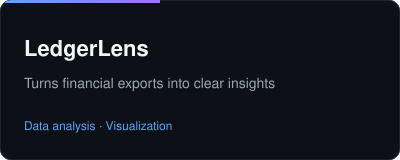
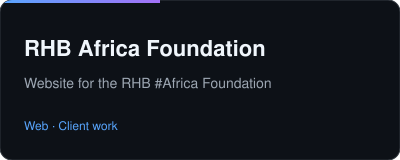
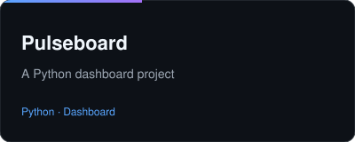
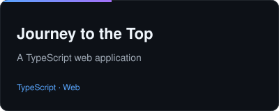
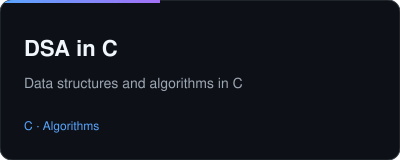

  

  <b>Software Engineer · Computer Scientist · DevOps Practitioner</b> 
  Based in Uganda 🇺🇬 · B.Sc. Computer Science, ISBAT University

  
  

  <em>I build full-stack web products, configure cloud pipelines and DevOps workflows, study AI/ML, and research how AI can improve system architecture and developer tooling.</em>

---

### 🧩 What I Work On

| Area | Focus |
|---|---|
| **Full-Stack Engineering** | Design-forward interfaces, reliable APIs, relational database design, and web services |
| **DevOps & Cloud** | Automated CI/CD pipelines, Docker containerization, infrastructure orchestration, server deployments |
| **AI-Assisted System Design** | Multi-agent workflows where models propose, critique, and reconcile architecture trade-offs before implementation |
| **Data Science & Research** | Data analysis, hypothesis testing, and technical documentation |
| **Currently Learning** | Advanced Kubernetes, MLOps pipeline automation, LLM fine-tuning |

---

### 🛠️ Stack & Technologies

<table>
  <tr>
    <td width="22%"><b>Languages</b></td>
    <td>
      
      
      
      
      
    </td>
  </tr>
  <tr>
    <td><b>Frameworks</b></td>
    <td>
      
      
    </td>
  </tr>
  <tr>
    <td><b>DevOps & Cloud</b></td>
    <td>
      
      
      
      
    </td>
  </tr>
  <tr>
    <td><b>Databases</b></td>
    <td>
      
    </td>
  </tr>
</table>

---

### ⭐ Featured: AI Architecture Consensus

An experimental multi-agent workflow where several AI models propose, critique, and reconcile system architectures before development starts. Includes prompt pipelines and experimental logs.

👉 **[Explore the repository →](https://github.com/NLY73022/ai-architecture-consensus)**

---

### 📦 Public Projects

  <table width="100%">
    <tr>
      <td width="50%" align="center">
        
      </td>
      <td width="50%" align="center">
        
      </td>
    </tr>
    <tr>
      <td width="50%" align="center">
        
      </td>
      <td width="50%" align="center">
        
      </td>
    </tr>
    <tr>
      <td colspan="2" align="center">
        
      </td>
    </tr>
  </table>

   
  <a href="https://github.com/NLY73022?tab=repositories"><b>See all repositories →</b></a>

---

### 💼 Engineering Case Studies

> Proprietary, client, and academic code is kept private. Technical overviews and live walkthroughs are available on request.

| Project | Technologies | Focus | Code |
|---|---|---|---|
| **Enterprise Booking & Management System** | React, Node.js, PostgreSQL, Docker | Multi-tenant booking workflow with automated containerized deployments and optimized query paths | 🔒 Private |
| **Real-Time Data Processing Service** | Python, WebSockets, Redis, CI/CD | Asynchronous backend service that aggregates and streams metrics, with continuous integration | 🔒 Private |
| **Automated Data Reporting Tool** | TypeScript, Node.js, GitHub Actions | Automated ETL reporting pipeline triggered and scheduled through CI/CD workflows | 🔒 Private |

---

### 📬 Contact

Open to remote software engineering roles, DevOps contracts, and AI research collaborations.

  

